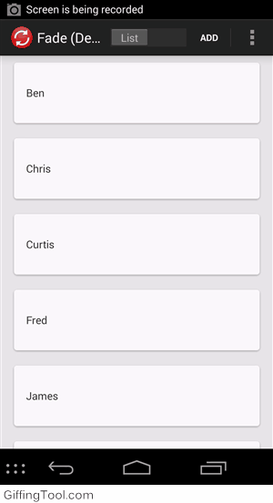
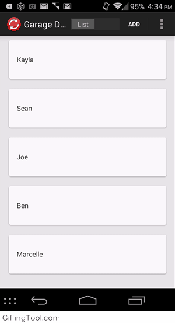

# Unlocking RecyclerView

There has been a lot of excitement about Android L's new RecyclerView.
 It replaces ListView and makes it easier/possible to manage the way views are laid out and items animated.
 The problem now is that the support library limits you to L as a minimum SDK version.
 There are ways to get around this and use the support library but the problem with that is you have no idea how much code from L there is in the support library.
 If that code is changed in the final release of L, then BOOM your app's TOASTED.

## There's a Library for that
For this reason the [RecyclerViewLib](https://github.com/twotoasters/RecyclerViewLib) has been created with gradle support.
 The source from the `recyclerview-v7` and `cardview-v7` support libraries have been copied into [RecyclerViewLib](https://github.com/twotoasters/RecyclerViewLib) and any code that references L has been removed.
 While this makes it safe to use after the final version of L has been released, it also means that it will be using the support views even on L.

## Implementing RecyclerView
RecyclerView has a few more components then ListView does.
 For detailed information on these components check out [Wolfram's blog post](http://www.grokkingandroid.com/first-glance-androids-recyclerview/).
 The only extra required component is the LayoutManager.
 Currently the support library only includes a LinearLayoutManager, allowing for both vertical and horizontal list views, but [RecyclerViewLib](https://github.com/twotoasters/RecyclerViewLib) has a GridLayoutManager as well which was borrowed from [RecyclerViewExtensions](https://github.com/antoniolg/RecyclerViewExtensions).
 The following is code shows how simple it is to implement RecyclerView.

In your xml

    #!xml
    <com.twotoasters.android.support.v7.widget.RecyclerView 
        xmlns:android="http://schemas.android.com/apk/res/android"
        xmlns:tools="http://schemas.android.com/tools"
        android:id="@+id/recyclerview"
        android:layout_width="match_parent"
        android:layout_height="match_parent"
        android:background="#e7e7e7"/>

Then in your activity's onCreate

    #!java
    @Override
    protected void onCreate(Bundle savedInstanceState) {
        super.onCreate(savedInstanceState);
        setContentView(R.layout.activity_recycle);

        mRecyclerView = findWidgetById(R.id.recyclerview);

        LinearLayoutManager layoutManager = new LinearLayoutManager(this);
        mRecyclerView.setLayoutManager(layoutManager);
        mRecyclerView.setAdapter(getAdapter());
    }

## Implementing RecyclerView.Adapter
`RecyclerView` does not use Android's standard BaseAdapter.
 The new `RecyclerView.Adapter` helps you recycle your views by having the entire focus on the `ViewHolder`, a new class added by `RecyclerView`.
 `getView()`, `newView()` and `bindView()` methods have all been replaced with `onCreateViewHolder()` and `onBindViewHolder()`.
 Note: currently there is no replacement for `ArrayAdapter` or `CursorAdapter`.

    #!java
    @Override
    public ItemViewHolder onCreateViewHolder(ViewGroup parent, int viewType) {
        LayoutInflater inflater = LayoutInflater.from(parent.getContext());
        View view = inflater.inflate(R.layout.item, parent, false);
        return new ItemViewHolder(view);
    }

    @Override
    public void onBindViewHolder(ItemViewHolder viewHolder, final int position) {
        final Item name = mNames.get(position);
        viewHolder.textView.setText(name.toString());
        viewHolder.textView.setOnClickListener(new OnClickListener() {
            @Override
            public void onClick(View v) {
                removeItemFromList(name);
            }
        });
    }
> ItemViewHolder is the example implementation of the abstract ViewHolder class.

Letting `RecyclerView` know when and which items to animate is also the responsibility of the adapter.
 The new methods `notifyItemInserted()` and `notifyItemRemoved()` work similarly to the still present `notifyDataSetChanged()` with the added benefit of triggering animations.

    #!java
    public void addToList(Item name, int position) {
        mNames.add(position, name);
        notifyItemInserted(position);
    }

    public void removeItemFromList(int position) {
        mNames.remove(position);
        notifyItemRemoved(position);
    }

## Implementing Item Animation
Item animations is the most exciting new RecyclerView feature for many people.
 The default animation is a nice fade in and fade out but it is easy to change animations on the `RecyclerView` using an `ItemAnimator`.

 

    #!java
    recyclerView.setItemAnimator(new RadItemAnimator);

Creating different animations is a bit trickier but we've got you covered in `RecyclerViewLib` with `PendingItemAnimator`.
 The `PendingItemAnimator` ensures that your animations always occur in a particular order.
 That order is Remove -> Move -> Add.
 To implement `PendingItemAnimator` there are three methods per animation type.
 `prepHolderForAnimateX()`, `animateXImp()` and `onXCanceled()` where X is either Remove, Move or Add.
 You get the move animation for free but it can change if desired. Check out this sweet garage door animation.

 

    #!java
    public class GarageDoorItemAnimator extends PendingItemAnimator {

        public GarageDoorItemAnimator() {
            setAddDuration(300);
            setRemoveDuration(300);
        }

        @Override
        protected boolean prepHolderForAnimateRemove(ViewHolder holder) {
            return true;
        }

        @Override
        protected ViewPropertyAnimatorCompat animateRemoveImpl(ViewHolder holder) {
            return ViewCompat.animate(holder.itemView)
                    .rotationX(90)
                    .translationY( - (holder.itemView.getMeasuredHeight() / 2));
        }

        @Override
        protected void onRemoveCanceled(ViewHolder holder) {
            ViewCompat.setRotationX(holder.itemView, 0);
            ViewCompat.setTranslationY(holder.itemView, 0);
        }

        @Override
        protected boolean prepHolderForAnimateAdd(ViewHolder holder) {
            ViewCompat.setRotationX(holder.itemView, 90);
            ViewCompat.setTranslationY(holder.itemView, - (holder.itemView.getMeasuredHeight() / 2));
            return true;
        }

        @Override
        protected ViewPropertyAnimatorCompat animateAddImpl(ViewHolder holder) {
            return ViewCompat.animate(holder.itemView)
                    .rotationX(0)
                    .translationY(0);
        }

        @Override
        protected void onAddCanceled(ViewHolder holder) {
            ViewCompat.setRotationX(holder.itemView, 0);
            ViewCompat.setTranslationY(holder.itemView, 0);
        }
    }

There are also 3 other animations that `RecyclerViewLib` includes, not counting the default fade animator.
 These are `FlipDownItemAnimator`, `SlideItemAnimator`, `FromTopItemAnimator`.
 You can check them all out on the sample app.

## Conclusion
RecyclerView is exciting because it blows past the limitations of ListView and GridView by making item animations easy to set and very reusable.
 Just keep in mind that the RecyclerView in [RecyclerViewLib](https://github.com/twotoasters/RecyclerViewLib) is a release candidate and not the final release. This means you may run into a few quirks.

## Continued Reading

- [Android Documentationn](https://developer.android.com/preview/material/ui-widgets.html)
- [A First Glance at Android’s RecyclerView](http://www.grokkingandroid.com/first-glance-androids-recyclerview/)
- [Selecting Items of a RecyclerView using StateListDrawables](http://www.grokkingandroid.com/statelistdrawables-for-recyclerview-selection/)